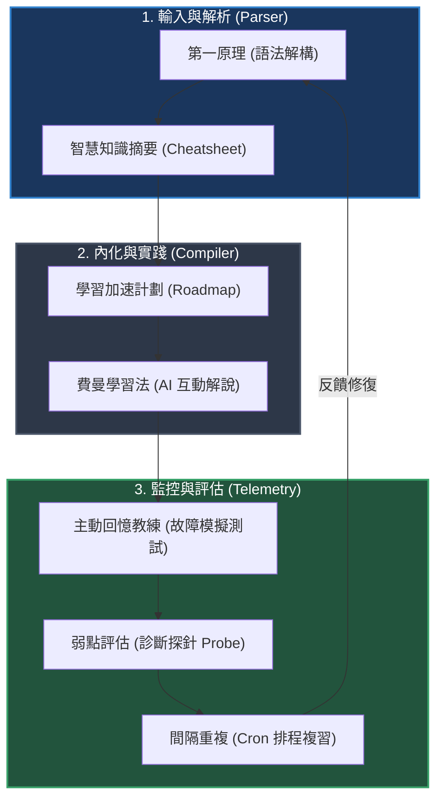

# 🛠️ SRE 中越雙語認知學習系統 (SV-CLS) 整合方案

> **歷史參考（已停用）**：七種學習法已被收斂為 Lexa v2 的具體介面行為。實作一律以 `PRODUCT_SPEC_PLAN.md` 為準。

本方案將你提供的 **7 大高效認知學習法**，與現有的「SRE 語境 + 越南經典歌曲」平台無縫對接。我們將這些學習理論轉化為 SRE 熟知的**系統架構與自動化流程**，打造一個高密度的語言學習環境。

---

## 🧭 SV-CLS 架構藍圖 (System Architecture)

我們將 7 大學習法劃分為三個層級：
1. **輸入與解析層 (Ingestion & Parsing)**：第一原理分解、智慧知識摘要。
2. **內化與模擬層 (Internalization & Simulation)**：費曼學習法、學習加速計劃。
3. **監控與驗證層 (Observability & Verification)**：主動回憶教練、弱點評估、間隔重複時間表。

---

## 📑 7 大學習法具體整合路徑

### 01. 費曼學習法 ──「Junior 模式解說器」
*   **整合方式**：在互動學習中，當你遇到不懂的語法（例如：時態助詞 `đã/đang/sẽ` 或否定句 `không phải là`），你可以對我發起以下指令。
*   **SRE 轉譯指令**：
    > 「請用極度簡單的語言向我解釋越南語的 `[特定語法/單字]`，就像在對一個實習生（Intern）解釋如何寫 Hello World 一樣。解釋完後，請讓我用我的理解（或 SRE 術語）重新向你描述一次，並幫我指出我理解中的 Bug (理解缺口)。」

---

### 02. 第一原理分解 ──「語法抽象語法樹 (AST) 解構」
*   **整合方式**：將越南語語法當作程式碼，拆解成最底層的「無變位、無時態字尾變形、全靠參數（助詞）傳遞」的本質。
*   **實施範例**（原型曾記錄於 `Vocabulary.md`）：
    *   **表面事實**：死記 `Anh đau từ lúc em đi` 的翻譯。
    *   **第一原理分解**：
        $$\text{Sentence} = \text{Subject(Anh)} + \text{State(đau)} + \text{Aspect/Time Linker(từ lúc)} + \text{Event(em đi)}$$
        越南語 = **「樂高積木式語法」**。沒有動詞變位，沒有陰陽性，只有「指針」與「值」的拼接。

---

### 03. 主動回憶教練 ──「Production 級 Incident 演練」
*   **整合方式**：學習完特定章節（如：第 08 章 決定動詞性質的助詞）或歌曲後，由我擔任 On-call Manager，隨機拋出故障情境，要求你即時以越南語進行 RCA 回報。
*   **SRE 轉譯指令**：
    > 「我們剛剛學完了 `[歌曲名稱]` 裡的語法。現在請模擬一個 P0 級故障情境，用越南語考驗我，迫使我不用看筆記，直接在終端機寫出翻譯或對話。隨後對我的答案進行 Code Review，給出精準的修復建議。」

---

### 04. 間隔重複時間表 ──「記憶體快取清理 CronJob」
*   **整合方式**：為你的學習路徑配置一個類似 Crontab 的間隔重複（Spaced Repetition）複習表。
*   **排程設計** (以現有的 80 個語法點與歌詞為例)：

| 週期 (Interval) | 觸發時間 (Cron Expression) | 複習目標 (Target Cache) | 驗證方法 (Verification Probe) |
| :--- | :--- | :--- | :--- |
| **D+1 (每日快取)** | `0 8 * * *` (每天早上 8 點) | 昨天學過的新單字/歌詞 5 句 | 快速默讀，卡頓則標記為 `Dirty Cache` |
| **W+1 (每週冷存)** | `0 9 * * 6` (每週六早上 9 點) | 當週學過的語法章節（如：05章 核心疑問詞） | 進行主動回憶（Active Recall）測試 |
| **M+1 (每月歸檔)** | `0 10 1 * *` (每月 1 號早上 10 點) | 上個月分析過的所有歌曲 | 邊聽歌邊盲填歌詞翻譯 |

---

### 05. 智慧知識摘要 ──「SRE 越南語 Cheat Sheet」
*   **整合方式**：在 `Vocabulary.md` 中，將你新增的 80 個語法點，整理成「三語對照思維模型表格」，並使用 CLI 友善的排版。
*   **範例設計**：
    *   *時態控制閥*：`đã` (已執行/Completed), `đang` (運行中/Running), `sẽ` (計畫中/Pending)。
    *   *條件分支判斷*：`Nếu... thì...` (If... then...)。

---

### 06. 學習加速計劃 ──「SRE 越南語掌握 Roadmap」
*   **整合方式**：建立一個名為 `Roadmap.md` 的新文件，將你那 80 個語法點與歌詞，規劃成 4 個「衝刺週期 (Sprints)」。
    *   **Milestone 1**: 基礎健康檢查 (01-04章) ── 能看懂基本 API 與 Config（基本語法、指示代名詞）。
    *   **Milestone 2**: 監控與提問 (05-07章) ── 能在 On-call 時發出 Diagnostic Queries（疑問詞、時態）。
    *   **Milestone 3**: 邏輯控制分支 (08-10章) ── 能夠撰寫複雜的語法邏輯（助動詞、前置詞、副詞）。
    *   **Milestone 4**: 系統集成 (11-13章 & 歌曲實戰) ── 能夠寫出優雅的越南語「程式碼」（相關連接詞、提案表達）。

---

### 07. 弱點評估 ──「系統健康診斷 (Health Check)」
*   **整合方式**：定期（例如每學完 10 個語法點）對你進行一次語法健康檢查。
*   **SRE 轉譯指令**：
    > 「請針對我目前學到第 `[X]` 章的語法點，出 3 題選擇題與 1 題開放式翻譯題。透過我的答案，診斷出我目前在『人稱代名詞』或『介詞』上的盲點，並提供針對性的 Patch (補丁) 學習資源。」

---

## 🛠️ 下一步行動計畫 (Action Items)

為了將這些方法真正落地到你的學習目錄下：

1. **新建 `Roadmap.md`**：將你的 80 個語法點與現有歌曲（《紅顏關》、《把青春還給我》、《自妳走後我心好痛》）串聯成一個 **Sprint 學習路線圖**。
2. **啟用「間隔重複 Cron 排程」**：使用 `/schedule` 或是由我定時提醒你複習。
3. **在對話中隨時調用**：當你想複習時，直接對我發送上述的 **[SRE 轉譯指令]**。
