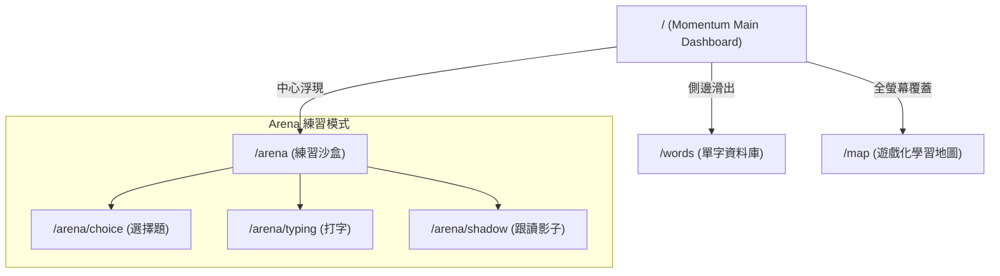
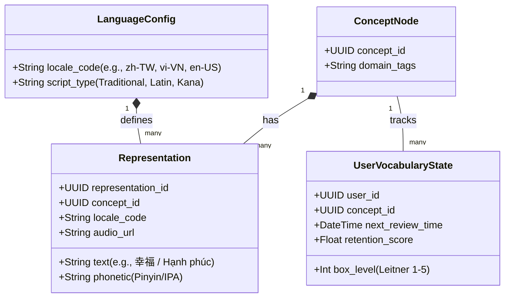

# 🌊 Momentum-Style 繁體中文學習平台 (越語版) 系統架構與產品規格書

> **歷史參考（未列入首發）**：本文件以越南人學繁中為受眾；首發改為台灣人學越南語。實作一律以 `PRODUCT_SPEC_PLAN.md` 為準。

本規格書旨在規劃一個以 **Momentum 簡約美學**為介面、以**認知科學**為底層、專為**越南人學習繁體中文 (Tiếng Trung Phồn Thể)** 設計的系統。系統架構具備多語言橫向擴展能力。

---

## 🎯 1. 小眾賽道定位與核心優勢 (The Niche Focus)

*   **目標受眾**：以越南語為母語，因工作、留學（前往台灣）、商務或文化興趣需要學習**繁體中文**的學習者。
*   **賽道差異化 (The Edge)**：
    1.  **漢越詞 (Từ Hán Việt) 降維打擊**：越南語中高達 60% 以上的詞彙源自古漢語。我們將「漢越音對照」作為第一原理的核心，讓越南人能在幾秒內記住複雜的繁體字意。
    2.  **無痛融入日常的 Momentum 工作流**：不強迫使用者打開專門的 App。它就是使用者的瀏覽器首頁或桌面看板，將「待辦事項」、「焦點狀態」與「華語學習」深度綁定。

---

## 🎨 2. UI/UX 與 Momentum 風格融合方案

將 Momentum 的寧靜美學與**遊戲化成就感**結合，呈現極簡卻有溫度的視覺。

### 視覺風格與組件 (Visual & Widgets)
*   **背景與氛圍**：每日精選療癒大圖。
*   **每日箴言 (Mantra/Quote)**：
    *   以**繁體中文 (附拼音) + 越南語譯文**呈現。
    *   滑鼠 Hover 在字詞上，會觸發「漢越詞 (Từ Hán Việt)」對照彈窗（例如：`Hạnh phúc` $\leftrightarrow$ `幸福`）。
*   **任務清單 (To-Do List) ✕ 學習觸發器**：
    *   當使用者在 To-Do List 中寫下任務（可以用越語或中文），系統會提供「中文翻譯建議」。
    *   當使用者**勾選完成 (Check)** 一個待辦事項時，系統會給予遊戲化的 XP (經驗值) 噴發動畫，並順勢帶出一個「3秒主動回憶單字測試」作為獎勵。
*   **遊戲化進度看板 (Gamified Achievements)**：
    *   畫面上方有一條極簡的「成長水位線」（非傳統的粗俗等級 icon），像潮汐一樣起伏，代表今日的「注意力積累」與「詞彙量 Uptime」。

---

## 🚦 3. 頁面路由與跳轉設計 (SPA / Extension Routing)

採用 **無感知平滑跳轉 (View Transitions)** 的單頁面 (SPA) 路由，保持 Momentum 的沈靜感。

*   **`/` (首頁/看板)**：主打專注力、天氣、搜尋、每日任務。
*   **`/words` (單字庫)**：採用資料夾與標籤分類。使用者在 `/arena` 練錯的字、或在首頁箴言中點擊過的字，都會自動同步到這裡。
*   **`/arena` (練習沙盒)**：無縫切換打字、選擇與影子練習。
*   **`/map` (成長樹)**：像 RPG 遊戲一樣的章節解鎖畫面（關卡設計對應 TOCFL 華語文能力測驗分級）。

---

## ⚙️ 4. 核心功能與 7 大學習法融合

我們將 7 大學習法內嵌至你要求的 6 大功能中：

| 現有核心功能 | 融入之認知學習法 | 具體 UX 實踐方案 |
| :--- | :--- | :--- |
| **1. 單字庫** | **間隔重複 (Spaced Repetition)** **智慧知識摘要** | 系統根據 Leitner 演算法自動計算每個單字的「衰退期」。在首頁 Widget 以「即將消逝的星光」視覺化提醒用戶複習。單字卡提供**「繁體字 + 拼音 + 漢越詞對照 + radical (部首拆解) 摘要」**。 |
| **2. 選擇題練習** | **主動回憶 (Active Recall)** **弱點評估** | 不是死板的刷題。題目會針對使用者在單字庫中標記為 `Weak (弱點)` 的字詞進行動態加權生成。錯題會自動觸發「錯誤分析補丁」。 |
| **3. 打字練習** | **肌肉記憶 + 拼音內化** | 越南人習慣使用 Telex 輸入法。在打字練習中，系統高亮繁體中文字，用戶需輸入正確的 **Pinyin** 或 **Bopomofo (注音)**。這能強迫用戶大腦將「字形」與「讀音」進行主動關聯。 |
| **4. 跟讀影子練習** | **AI 語音反饋 (未來擴充)** | 播放一段 5 秒的台灣在地生活口語對話，使用者進行跟讀。底層框架會預留 API 接口，比對音訊特徵，以極簡的紅黃綠波形回饋發音準確度。 |
| **5. 個人進度 (首頁)**| **學習加速計劃 (Roadmap)** | 以「栽種植物」或「島嶼建設」等極簡 2D 風格積累成就感。每一次練習成功，畫面中的「繁體中文知識樹」就會生長一片葉子。 |

---

## 🧱 5. 技術架構與多語言擴充設計 (Scalable Tech Architecture)

為了確保未來能無縫擴展至其他語系（如：越南人學英文、日本人學繁體中文、英文人學越南語），我們必須在資料庫與邏輯層上實施**「語言解耦 (Language Decoupling)」**。

### 多語言通用資料模型 (Data Schema)

我們將語言字詞設計為**「概念節點 (Concept Node)」**與**「語義表達 (Representation)」**分離的架構：

*   **概念 (ConceptNode)** 是中立的（例如：ID `c-999` 代表「Happiness」的概念）。
*   **表達 (Representation)** 則是具體語言的對應（`zh-TW` 下是 `幸福`，`vi-VN` 下是 `Hạnh phúc`）。
*   **優勢**：當未來想新增「越南人學英文」，只需加入 `en-US` 的 Representation 即可，核心複習邏輯、打字系統、選擇題生成引擎**完全不需要重寫**。

---

## 🌐 6. 未來擴展性與使用者體驗評估 (UX Evaluation)

### 體驗評估 (Pros & Cons)
*   **優勢 (Pros)**：
    *   *低認知負荷*：Momentum 風格能減少學習的焦慮感，將學習時間碎片化地融入日常開新分頁的動作中。
    *   *超強黏著度*：結合 To-Do list，每次完成工作任務就是一次語言學習的觸發器。
*   **潛在風險 (Cons) 與對策**：
    *   *流失注意力*：首頁功能過多可能干擾工作。
    *   *對策*：提供「一鍵切換 Focus Mode」，隱藏所有學習 Widget，僅保留簡約時鐘與待辦清單，讓使用者擁有完全的主導權。
